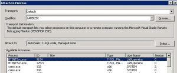

# Determining the process ID of BizTalk Host Instances with PowerShell
We can debug for example, external assembly’s that are called from within a BizTalk process or debugging pipeline components in run-time mode. In Visual Studio set breakpoints in your code. To debug you must attach to the BizTalk process that is running the .Net code.

However if we have more than one host instance configured, when we open the debug menu and choose attach to process, it appears all host instance with the same process name (“BTSNTSvc.exe”), like this:

So if we don’t want to attach all processes, we need to determine which process to attach to.

You can do this by many ways:
* You can use the TASKLIST command to query the processes. Execute the following command in a command prompt on the remote box
* Using C# code
* Or with powershell
 
The script can be downloaded and executed in powershell. Open Powershell and drag the HostInstancesProcessID.ps1 file into PowerShell Window. Then enter return.

THIS POWERSHELL IS PROVIDED "AS IS", WITHOUT WARRANTY OF ANY KIND.

# About Me
**Sandro Pereira** | [DevScope](http://www.devscope.net/) | MVP & MCTS BizTalk Server 2010 | [https://blog.sandro-pereira.com/](https://blog.sandro-pereira.com/) | [@sandro_asp](https://twitter.com/sandro_asp)