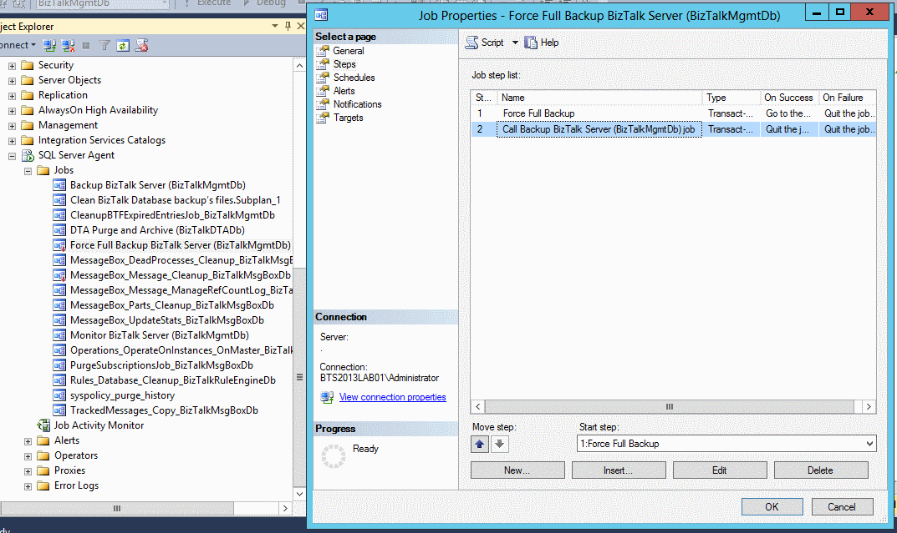

# Force Full Backup BizTalk Server (BizTalkMgmtDb) Job
BizTalk Server databases and their health are very important for a successful BizTalk Server database messaging environment. BizTalk is shipped out with a total of 13 SQL Agent jobs that perform important functions to keep your servers operational and healthy.

Like any other system, all BizTalk Server databases should be backed up and BizTalk Server will provide out-of-the-box a job for accomplished that: Backup BizTalk Server (BizTalkMgmtDb) job.

This job makes both Full and Log backups. By default the Backup BizTalk Server job performs a full backup once a day and performs log backups every 15 minutes. This means that once the full backup is performed you need to wait 24 hours for it to automatically do another full backup of the BizTalk Server databases… even if you try to manually run the job, it will only make the backups of the log files.

But sometimes we need, for several reasons, to have the ability and the possibility to force a full backup:
* We will have some maintaining plan on the server, or apply a new configuration, and we want to backup the environment
* Or simple we will install a new integration application and again we want to have a backup in this exact moment

Each company have is policies, so again for several reasons, we sometimes need to force a full backup of all BizTalk Server databases.

The standard way is to use the **BizTalkMgmtDb.dbo.sp_ForceFullBackup** stored procedure. However, and unlike what many people think, this stored procedure does not perform a full backup it only marks internally on BizTalk Server databases that the next time the Backup BizTalk Server job runs it will need to perform a full backup of the data and log files.

And because this is not a day by day task people tend to forget all the steps and sometimes create custom scripts to perform this task but you need to be aware of two things:
* The Backup BizTalk Server job is the only supported method for backing up the BizTalk Server databases. Use of SQL Server jobs to back up the BizTalk Server databases in a production environment is not supported.
* You can use the SQL Server methods to back up the BizTalk Server databases only if the SQL Server service is stopped and if all BizTalk Server processes are stopped.
 
So to help one of my DBA teams I end up creating this job that is composed by two steps:
* Step 1: Force Full Backup
  * That will call the “BizTalkMgmtDb.dbo.sp_ForceFullBackup” stored procedure
* Step 2: Backup BizTalk Server
  * That will call Backup BizTalk Server (BizTalkMgmtDb) job
  

 
THIS SQL SCRIPT IS PROVIDED "AS IS", WITHOUT WARRANTY OF ANY KIND.

# About Me
**Sandro Pereira** | [DevScope](http://www.devscope.net/) | MVP & MCTS BizTalk Server 2010 | [https://blog.sandro-pereira.com/](https://blog.sandro-pereira.com/) | [@sandro_asp](https://twitter.com/sandro_asp)