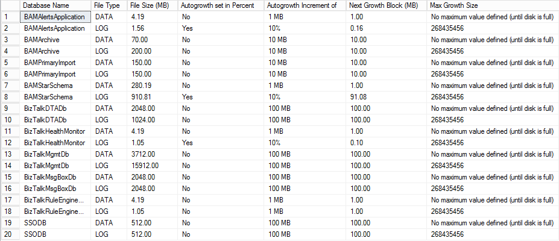

# Check auto-growth settings for BizTalk Server databases
Auto growth setting plays an important role in BizTalk configuration for performance reasons, why?

SQL Server database auto-growth is a blocking operation which hinders BizTalk Server database performance. When SQL Server increases the size of a file, it must first initialize the new space before it can be used. This is a blocking operation that involves filling the new space with empty pages.

Therefore it's recommended to:
* Set this value (databases auto-growth) to a fixed value of megabytes instead of to a percentage, so SQL server doesn't waste is resources expanding the data and log files during heavy processing. This is especially true for the MessageBox and Tracking (DTA) databases:
  * In a high throughput BizTalk Server environment, the MessageBox and Tracking databases can significantly increase. If auto-growth is set to a percentage, then auto-growth will be substantial as well.
  * As a guideline for auto-growth, for large files increment should be no larger than 100 MB, for medium-sized files 10 MB, or for small files 1 MB.
  * This should be done so that, if auto-growth occurs, it does so in a measured fashion. This reduces the likelihood of excessive database growth.
* Also allocate sufficient space for the BizTalk Server databases in advance to minimize the occurrence of database auto-growth.
 
## How can we check these settings?
We can do it manually and check one by one witch is time consuming or we can use this SQL script will check and provide you will all the important about auto growth setting for all BizTalk Server databases.

 
THIS SQL SCRIPT IS PROVIDED "AS IS", WITHOUT WARRANTY OF ANY KIND.

# About Us
**Sandro Pereira** | [DevScope](http://www.devscope.net/) | MVP & MCTS BizTalk Server 2010 | [https://blog.sandro-pereira.com/](https://blog.sandro-pereira.com/) | [@sandro_asp](https://twitter.com/sandro_asp)