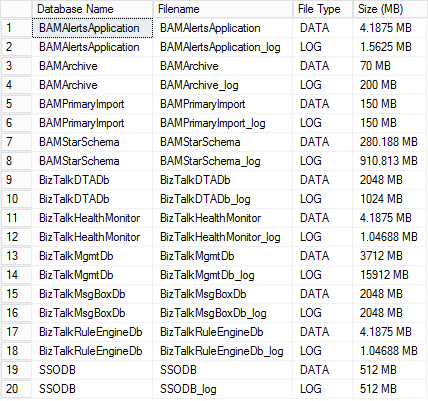

# Check BizTalk Server databases sizes
BizTalk Server database databases and their health are very important for a successful BizTalk Server database messaging environment. BizTalk Server is an extremely database-intensive platform and one of the main reasons is that because one of the primary design goals of BizTalk Server is to ensure that no messages are lost, BizTalk Server persists data to disk with great frequency and furthermore, does so within the context of an MSDTC transaction. Therefore, database performance is paramount to the overall performance of any BizTalk Server solution.

Microsoft BizTalk Server installs several databases in SQL Server, however, BizTalk Server runtime operations typically use these four databases: BizTalk Server Management database, MessageBox databases, Tracking database, and SSO database. Depending on the BizTalk Server functionality that you use, you may have some or all of the other databases in the table.

And if some of these databases become too large it may adversely impact the overall platform performance. So it is important to check the databases sizes and define since day one the correct sizes according to some of the best practices:
* **BizTalkDTADb (BizTalk Tracking database)**: Data file having a file size of 2 GB with 100 MB growth and a log file of 1 GB with 100 MB growth.
* **BizTalkMgmtdb (BizTalk Management database)**: Data file having a file size of 512 MB with 100 MB growth and a log file of 512 MB with 100 MB growth.
* **SSODB (SSO database)**: Data file having a file size of 512 MB with 100 MB growth and a log file of 512 MB with 100 MB growth.
* **BizTalkMsgBoxDb (BizTalk MessageBox database)**: Data file having a file size of 2 GB with 100 MB growth and a log file of 2 GB with 100 MB growth.
* **BAMPrimaryImport (BAM Primary Import database)**: Data file having a file size of 150 MB with 10 MB growth and a log file of 150 MB with 100 MB growth.
* **BAMArchive (BAM Archive)**: Data file having a file size of 70 MB with 10 MB growth and a log file of 200 MB with 10 MB growth.
* **BizTalkRuleEngineDb (Rule Engine database)**: Data file with 1 MB growth and a log file with 1 MB growth.

**Note**: These values ​​were used for a standalone environment. In a high throughput BizTalk Server environment you should consider devide the BizTalkMsgBoxDb in 8 data files, each having a file size of 2 GB with 100 MB growth and a log file of 20 GB with 100 MB growth. Because the BizTalk MessageBox databases are the most active, we recommend you place the data files and transaction log files on dedicated drives to reduce the likelihood of problems with disk I/O contention, as is explained here: http://msdn.microsoft.com/en-us/library/ee377048.aspx

This SQL script will check and provide you will all the important informations about the sizes of all BizTalk Server databases.
 
THIS SQL SCRIPT IS PROVIDED "AS IS", WITHOUT WARRANTY OF ANY KIND.

# About Us
**Sandro Pereira** | [DevScope](http://www.devscope.net/) | MVP & MCTS BizTalk Server 2010 | [https://blog.sandro-pereira.com/](https://blog.sandro-pereira.com/) | [@sandro_asp](https://twitter.com/sandro_asp)